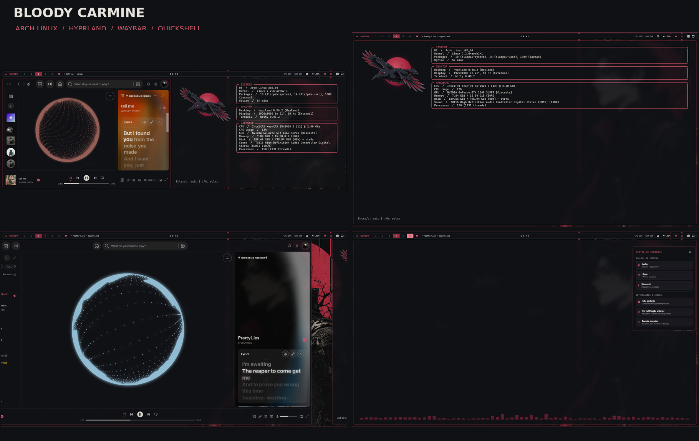

# Bloody Carmine · Arch Linux + Hyprland

Meus dotfiles ativos para um desktop Arch Linux com Hyprland/HyDE, paleta grafite e carmim, Waybar personalizada, Rofi, Kitty e centro de controle Quickshell.



> O setup original foi montado sobre HyDE. Os arquivos aqui registram a camada pessoal, não substituem nem redistribuem o HyDE. Leia `docs/CONFIGURACAO.md` antes de aplicar em outra máquina.

## Stack

- Arch Linux · Hyprland (configuração Lua) · HyDE
- Waybar · Rofi · Kitty · Quickshell · Cava · Fastfetch
- Dunst · wlogout · GTK 3/4 · Qt5ct/Qt6ct · Kvantum
- Tema: Bloody Carmine · fundo grafite `#101115` · acento `#d75b6e`

## O que está incluído

- `hypr/`: camada pessoal Hyprland/Lua e idle/lock; integra com HyDE já instalado.
- `waybar/`: layout Carmine escolhido e CSS personalizado.
- `quickshell/`: centro de controle rápido.
- `kitty/`, `rofi/`, `fastfetch/`, `cava/`: aparência e identidade do terminal.
- `spicetify/visualizer/`: Spicetify Visualizer, pin upstream registrado em `spicetify/README.md`.
- `gtk/`, `qt/`, `kvantum/`, `wlogout/`: detalhes de tema desktop.
- `wallpaper/`: papel de parede usado neste tema.
- `showcase/`: imagens para a publicação.

O serviço de notificações ativo é o Dunst. SwayNC fica fora do conjunto ativo porque disputa o nome D-Bus de notificações com Dunst. Alguns módulos de energia e as ações de Waybar usam comandos fornecidos pelo HyDE.

## Instalação

Instale Arch Linux, Hyprland e HyDE primeiro. Confira as dependências, backup e limitações em [`docs/CONFIGURACAO.md`](docs/CONFIGURACAO.md). Depois:

```bash
git clone https://github.com/AizenVisuals/bloody-carmine-dotfiles.git
cd bloody-carmine-dotfiles
./install.sh
```

O instalador cria backups datados dos caminhos que serão substituídos, copia os dotfiles e instala o serviço de usuário Quickshell desabilitado. Revise o arquivo copiado `~/.config/quickshell/bloody-control/bloody-control.service` e habilite com `systemctl --user enable --now bloody-control.service` quando estiver pronto.

O script não instala pacotes, não muda o tema GTK/Qt do sistema e não substitui a configuração base do HyDE. O wallpaper também é colocado em `~/.local/share/bloody-desktop/` para o Fastfetch. GTK usa o tema incluso via `gtk.css`; selecione `Bloody-Carmine` em seu gerenciador de aparência para aplicar os controles GTK.

## Showcase

As capturas adicionais do setup estão em [`showcase/`](showcase/).

## Licenças e créditos

Este repositório reúne configuração pessoal, assets originais e arquivos derivados. Veja [`THIRD_PARTY.md`](THIRD_PARTY.md) antes de redistribuir. O arquivo `kitty/bloody.conf` conserva os créditos MIT do tema Catppuccin. A arte do wallpaper foi gerada para este desktop.
